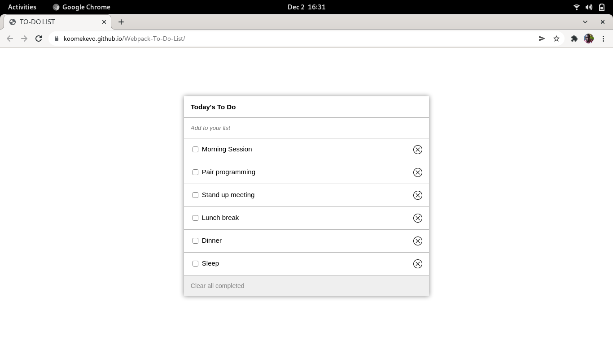

# To Do List

> This is a to do list project built with Webpack.

## Live Demo

https://koomekevo.github.io/Webpack-To-Do-List/

## Built With

- HTML
- JavaScript
- CSS
- Webpack

## Getting Started

Clone the git repository using SSH or HTTP

Next open terminal run `cd Webpack-To-Do-List`

Run `npm run build`

Finally run `npm start` to start the server and load the website.

## Authors

👤 **Kevin Koome**

- GitHub: [@koomekevo](https://github.com/koomekevo)
- Twitter: [@koomekevo](https://twitter.com/koomekevo)
- LinkedIn: [LinkedIn](https://ke.linkedin.com/in/kevin-koome-aab84186)

## 🤝 Contributing

Contributions, issues, and feature requests are welcome!

Feel free to check the [issues page](../../issues/).

## Show your support

Give a ⭐️ if you like this project!

## 📝 License

This project is [MIT](./MIT.md) licensed.